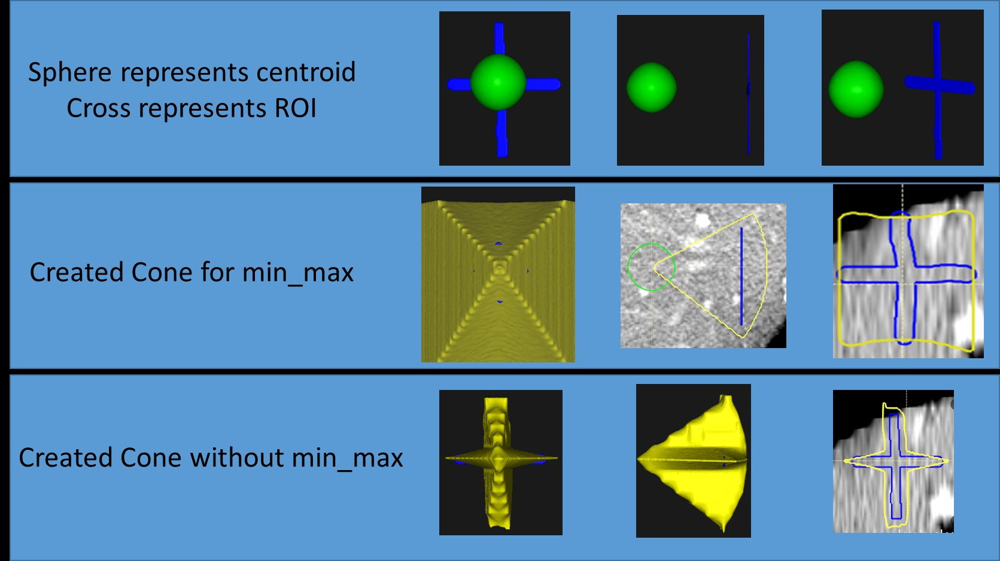

"# Local_Recurrence_Work" 

This is work done to create a pseudo-raytrace to identify if the 5mm minimum ablation margin is occuring in the same region as the local recurrence.

The 'Proof_Of_Concept_Cross' takes two rois, defined as 'Test_Ablation' and 'Test_Cross', shown in the 'Picture_With_Cross_Explanation' as the yellow cylinder and blue cross.
The min_max picture shows a very fast approach that only looks at the minimum/maximum phi/theta in spherical coorindates to draw a cone of influence.
The not min_max picture show a slightly slower approach to identify fine edges.

It is recommended not to use a margin greater than 100, as the process becomes increasingly slow with more points.
It is recommended to use a margin_rad of at least 5 degrees.

    import numpy as np
    recurrence_path = os.path.join(images_path, MRN, Recurrence)
    recurrence_reader = Dicom_to_Imagestack(arg_max=False, Contour_Names=['Test_Ablation','Test_Cross'])
    recurrence_reader.Make_Contour_From_directory(recurrence_path)

    mask = recurrence_reader.mask
    ablation_base = mask[...,1]
    cross_base = mask[...,2]

    centroid_of_ablation_recurrence = np.asarray(center_of_mass(ablation_base))
    spacing = recurrence_reader.annotation_handle.GetSpacing()
    output = create_output_ray(centroid_of_ablation_recurrence, spacing=spacing, ref_binary_image=cross_base,
                      margin_rad=np.deg2rad(5), margin=50, min_max=False)
    recurrence_reader.with_annotations(output, output_dir=os.path.join(recurrence_path, 'new_RT'),
                                       ROI_Names=['cone_cross_fixed'])
 
